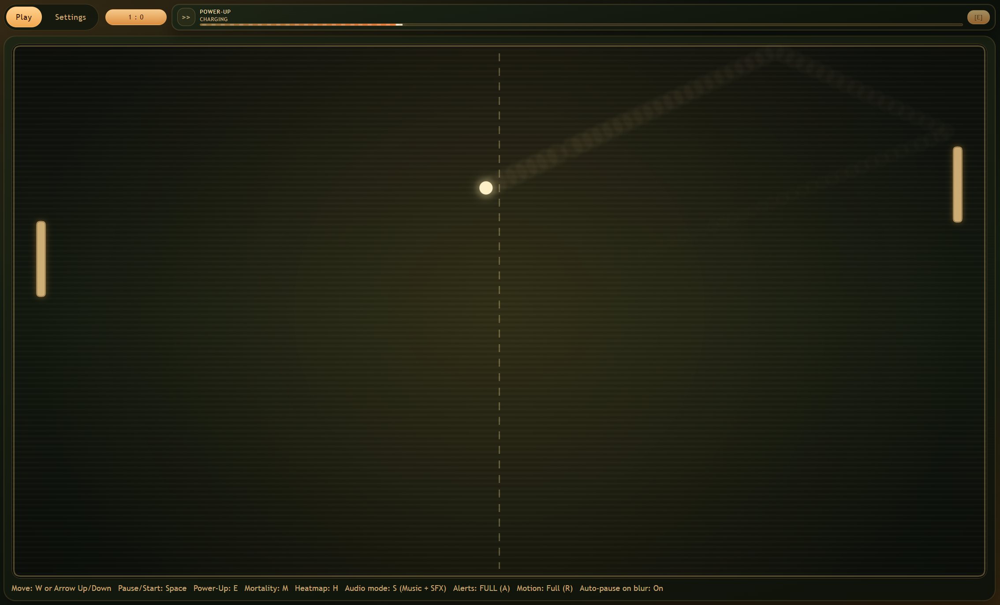

# Web Pong'ish

Fast, browser-based arcade rallies with power-up swings, clutch shield saves, and one-shot momentum flips.

## Overview

Pong'ish is built for quick matches and immediate rematches.  
You jump in fast, trade high-speed rallies with the AI, and use timed power-ups to steal points at the edge of a comeback.



> Gameplay preview from the current local build.

## Gameplay and Controls

### Match Flow

1. Open app and select `Enter Arena`.
2. Start via `Space`, `Enter`, or start action.
3. 3-second countdown begins (`3, 2, 1`).
4. Game runs until either side reaches winning score.

### Keyboard Controls

- Move paddle: `W`, `ArrowUp`, `ArrowDown`
- Start/Pause/Resume: `Space`
- Start countdown: `Enter`
- Activate manual power-up: `E`
- Activate one-time mortality ability: `M`
- Toggle heatmap: `H`
- Cycle audio mode: `S`
- Cycle power-up alert mode: `A`
- Toggle reduced-motion override: `R`

### Match Behavior Highlights

- Auto-pause on window blur.
- Random power-up drops during play.
- One-time mortality mechanic per match.
- Score pauses the match and triggers a new 3-second countdown.

For detailed mechanics, see `docs/game-mechanics.md`.

## Settings and Persistence

### Settings

- Stored in `localStorage` key `pong.settings.v1`.
- Configurable ranges:
  - Winning score: `1-21`
  - Paddle speed: `250-900`
  - Ball speed: `200-900`
  - AI difficulty: `1-10`

### Saved Games

- Stored in IndexedDB database `pong_local`, store `saved_games`.
- `saved-games` use cases support save/list/load/delete and autosave records.
- Runtime play flow currently does not expose a save/load menu in the shell UI.

## Project Overview (Technical)

Pong'ish is a client-only TypeScript application using React + Canvas, organized with feature-first Clean Architecture and a message-driven actor runtime.

- Runtime model: deterministic simulation with explicit session commands and fixed-step ticking (`~16.67ms` target step).
- Architecture model: per-feature layers (`domain`, `application`, `interface-adapters`, `frameworks-drivers`) with inward-only dependencies.
- State model: volatile runtime state in memory; durable state in browser storage.
- Persistence model: settings in `localStorage` and saved games in IndexedDB (`pong_local` / `saved_games`) with non-browser memory fallback.
- Composition model: manual, typed dependency injection via composition roots in `frameworks-drivers/di`.
- Product constraints: no backend, no authentication, no server-side components in v1.

## Table of Contents

- [Core Features](#core-features)
- [Quick Start](#quick-start)
- [Scripts](#scripts)
- [Gameplay and Controls](#gameplay-and-controls)
- [Settings and Persistence](#settings-and-persistence)
- [Architecture](#architecture)
- [Project Layout](#project-layout)
- [Testing](#testing)
- [Performance Targets](#performance-targets)
- [Documentation](#documentation)
- [v1 Scope and Non-Goals](#v1-scope-and-non-goals)

## Core Features

- AI opponent gameplay with score-to-win matches.
- Countdown-based start and between-point restarts.
- Power-up system with auto and manual activations.
- One-time per match mortality mechanic.
- WebAudio-based reactive audio cues and music.
- Settings panel with validation and default reset.
- Actor-protocol-driven session orchestration.

## Quick Start

### Prerequisites

- Node.js 20+
- npm

### Install

```bash
npm install
```

### Start Development Server

```bash
npm run dev
```

### Build Production Bundle

```bash
npm run build
```

### Preview Production Build

```bash
npm run preview
```

## Scripts

- `npm run dev`: start Vite dev server
- `npm run build`: type-check app tsconfig and build bundle
- `npm run preview`: serve built output locally
- `npm run typecheck`: run TypeScript checks only
- `npm run lint`: run ESLint checks
- `npm run test:run`: run Vitest suite once

## Architecture

### Feature Layer Contract

Each feature keeps these direct child folders:

- `domain`
- `application`
- `interface-adapters`
- `frameworks-drivers`

### Dependency Direction

Allowed flow:

`frameworks-drivers -> interface-adapters -> application -> domain`

Domain code remains framework-agnostic and deterministic.

### Actor Runtime

- FIFO mailbox runtime in `src/shared/actors/runtime.ts`
- Typed actor messages with explicit dispatch
- Explicit `flush()` processing for predictable message handling

### Composition Root

- Shared dependencies composed in `src/app/frameworks-drivers/di/createAppModule.ts`
- Feature modules wired through typed module contracts in `src/app/frameworks-drivers/di/module-types.ts`

## Project Layout

```text
src/
  app/
    frameworks-drivers/di/
  features/
    pong-game/
    saved-games/
    settings/
    shell/
  shared/
    actors/
    clock/
    storage/
    types/
docs/
  plans/
    adr/
tests/
```

## Testing

Run the full suite:

```bash
npm run test:run
```

Coverage includes:

- Domain gameplay rules
- Actor protocol behavior
- Save/load integration flow
- Power-up behavior
- Session stability/performance checks

## Performance Targets

Tracked in `docs/plans/05-performance-statefulness-plan.md`:

- 60 FPS target on modern desktop browsers
- Fixed-step simulation target around `16.67ms`
- Input-to-frame latency target `<= 50ms`
- Save/load target `<= 100ms` for typical payloads

## Documentation

- Planning workspace: `docs/plans/README.md`
- ADR index: `docs/plans/adr/README.md`
- Feature status and recommendations: `docs/features.md`
- Game mechanics reference: `docs/game-mechanics.md`

## v1 Scope and Non-Goals

### In Scope

- AI opponent mode
- Desktop keyboard input
- Local browser persistence
- React + Canvas UI

### Out of Scope

- Server-side gameplay or APIs
- Authentication/login flows
- Cloud persistence
- Mobile/touch-first controls
- Replay playback
